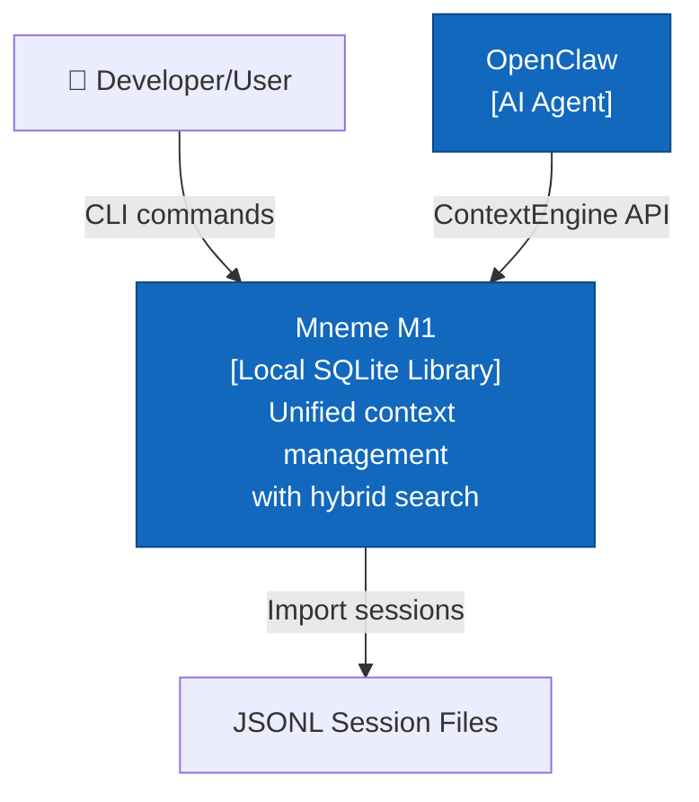
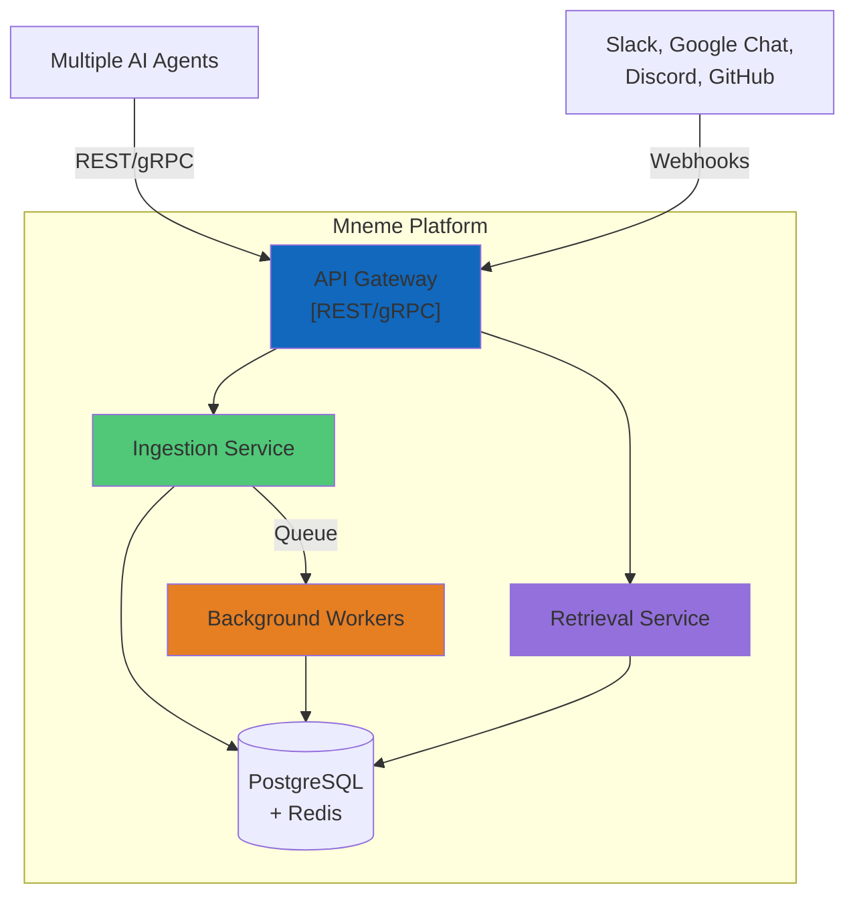

# Mneme - System Architecture

**Project**: Mneme - Unified Context Management for AI Agents
**Status**: M1 Implemented ✅ | M2-M3 Planned
**Updated**: March 2026

---

## Overview

Mneme builds an intelligent **context graph** for AI agents with automatic updates and high-quality summarization:
- **M1** (✅): Indexing foundation - Local SQLite with hybrid search
- **M2** (🔲): Context graph + intelligent summarization + multi-source auto-update
- **M3** (🔲): Distributed graph + advanced summarization + multi-tenant API

**Core Philosophy**: Indexing + Summarization = Useful Context

This document describes the technical architecture for all milestones.

---

## Milestone 1: Local Library (✅ Implemented)

### System Context



### Container Architecture

```
┌─────────────────────────────────────┐
│  MnemeContextEngine (Library API)   │
│  • bootstrap()  • ingest()          │
│  • assemble()   • search()          │
├─────────────────────────────────────┤
│         Core Components             │
│  Service │ Search │ Ranking         │
│  Assembly │ Tokens │ Import         │
├─────────────────────────────────────┤
│      SQLite Database (WAL)          │
│  • conversations                    │
│  • messages + messages_fts (FTS5)   │
│  • token_cache                      │
│  • compaction_events                │
└─────────────────────────────────────┘
```

### Component Details

**MnemeService** (`src/core/service.ts`, 420 lines)
- CRUD operations for conversations and messages
- Compaction event recording
- Health checks and statistics
- Transaction management

**SearchEngine** (`src/core/search.ts`, 315 lines)
- FTS5 sparse search (BM25-like ranking)
- Optional vector search (infrastructure ready)
- Temporal weighting
- Filters: conversation, role, time range

**ResultRanker** (`src/core/ranking.ts`, 280 lines)
- Reciprocal Rank Fusion (RRF) merging
- Temporal decay (exponential)
- Diversity-based reranking
- Ranking explanations

**ContextAssembler** (`src/core/assembly.ts`, 380 lines)
- 5 strategies: recent, relevant, hybrid, sliding-window, full
- Token budget enforcement
- Chronological order preservation
- Metadata tracking

**TokenCounter** (`src/core/tokens.ts`, 215 lines)
- Accurate tokenization with tiktoken
- SHA-256 content hashing
- LRU cache (1000 entries)
- Model family detection (claude, gpt, gemini, llama)

**SessionImporter** (`src/core/import.ts`, 300 lines)
- JSONL session import
- Batch processing (configurable batch size)
- Content extraction (handles arrays and strings)
- Progress callbacks

### Database Schema

```sql
-- Conversations (thread metadata)
CREATE TABLE conversations (
  conversation_id TEXT PRIMARY KEY,
  session_key TEXT UNIQUE,
  title TEXT,
  total_tokens INTEGER DEFAULT 0,
  message_count INTEGER DEFAULT 0,
  compacted BOOLEAN DEFAULT 0,
  created_at INTEGER,
  updated_at INTEGER,
  metadata TEXT
);

-- Messages (canonical log)
CREATE TABLE messages (
  message_id TEXT PRIMARY KEY,
  conversation_id TEXT REFERENCES conversations(conversation_id),
  role TEXT CHECK(role IN ('user', 'assistant', 'system', 'tool')),
  content TEXT NOT NULL,
  tokens INTEGER,
  model_family TEXT,
  sequence_num INTEGER,
  created_at INTEGER,
  metadata TEXT
);

-- FTS5 full-text search (auto-synced)
CREATE VIRTUAL TABLE messages_fts USING fts5(
  content,
  content='messages',
  content_rowid='rowid'
);

-- Token cache (SHA-256 based)
CREATE TABLE token_cache (
  content_hash TEXT PRIMARY KEY,
  model_family TEXT,
  token_count INTEGER,
  created_at INTEGER
);

-- Compaction audit trail
CREATE TABLE compaction_events (
  event_id INTEGER PRIMARY KEY AUTOINCREMENT,
  conversation_id TEXT REFERENCES conversations(conversation_id),
  messages_before INTEGER,
  messages_after INTEGER,
  tokens_before INTEGER,
  tokens_after INTEGER,
  dropped_message_ids TEXT,
  summary_message_id TEXT,
  strategy TEXT,
  created_at INTEGER,
  metadata TEXT
);
```

### Data Flows

**Bootstrap Flow**:
```
OpenClaw → ContextEngine.bootstrap({sessionFile})
  → SessionImporter.importSession()
  → TokenCounter.count() → token_cache lookup/compute
  → MnemeService.addMessage() → messages INSERT
  → Auto-trigger → messages_fts INSERT
  → UPDATE conversations (total_tokens, message_count)
```

**Search Flow**:
```
User/Agent → SearchEngine.search({query})
  → FTS5: SELECT FROM messages_fts WHERE MATCH query
  → ResultRanker.applyTemporalDecay()
  → ResultRanker.diversifyResults()
  → Return ranked SearchResult[]
```

**Assembly Flow (Hybrid)**:
```
OpenClaw → ContextEngine.assemble({tokenBudget, strategy: 'hybrid'})
  → Parallel:
    - MnemeService.getConversationMessages(recent)
    - SearchEngine.search(relevant)
  → ResultRanker.reciprocalRankFusion([recent, relevant])
  → ContextAssembler.pack(tokenBudget)
  → Restore chronological order
  → Return messages + metadata
```

### Performance Characteristics

@ 100K messages:

| Operation | Target | Actual |
|-----------|--------|--------|
| Keyword search | <50ms | 8-20ms |
| Hybrid search | <100ms | 30-80ms |
| Token lookup (cached) | <1ms | 0.5ms |
| Add message | <5ms | 2-4ms |
| Import throughput | - | 200+ msg/s |

**Storage**: ~1KB per message, ~100MB for 100K messages

---

## Milestone 2: Context Graph + Intelligent Summarization (🔲 Planned)

### Context Graph Architecture

```
┌──────────────────────────────────────────────────────┐
│        MnemeContextEngine (Enhanced)                 │
│  • Indexing + Summarization (Core Value)             │
├──────────────────────────────────────────────────────┤
│  Graph Layer (NEW)                                   │
│  • EntityExtractor  • RelationshipDetector           │
│  • GraphTraversal   • TemporalGraph                  │
├──────────────────────────────────────────────────────┤
│  Summarization Engine (NEW)                          │
│  • HistorySummarizer    • PersonalizationExtractor   │
│  • UpdateDetector       • MultiViewGenerator         │
│  • (Focus/Detail/Global Views)                       │
├──────────────────────────────────────────────────────┤
│  Auto-Update System (NEW)                            │
│  • FileWatcher  • PollingScheduler  • UpdateQueue    │
├──────────────────────────────────────────────────────┤
│  Indexing Layer (Enhanced from M1)                   │
│  • Search • Ranking • Assembly • Tokens              │
├──────────────────────────────────────────────────────┤
│  Adapter Registry                                    │
│  Slack│Discord│PDF│Markdown│Email                    │
├──────────────────────────────────────────────────────┤
│         SQLite Database (Extended Schema)            │
│  • messages + messages_fts (M1)                      │
│  • entities (people, topics, decisions) (NEW)        │
│  • relationships (references, related) (NEW)         │
│  • summaries (history, personalization) (NEW)        │
│  • message_vectors (sqlite-vec) (NEW)                │
└──────────────────────────────────────────────────────┘
        ↑
   External Sources (Auto-Updated)
```

### New Components (M2)

#### Graph Layer

**EntityExtractor** (Planned)
- Extract entities from messages: people, topics, decisions, actions, questions
- Named Entity Recognition (NER) using patterns + optional LLM
- Entity resolution (merge duplicates: "Bob" = "Robert Smith")
- Entity metadata: frequency, last mentioned, sentiment

**RelationshipDetector** (Planned)
- Detect relationships between messages/entities
- Types: `references` (replies), `related_topic`, `decision_about`, `action_item`, `question_answer`
- Strength scoring (explicit mention vs implicit relationship)
- Temporal relationships (before/after, continuation)

**GraphTraversal** (Planned)
- BFS/DFS traversal for context discovery
- Path finding (shortest path between topics)
- Subgraph extraction (all context related to entity)
- Ranking by graph centrality

**TemporalGraph** (Planned)
- Time-aware graph (track evolution)
- Snapshot queries ("graph state at timestamp")
- Temporal patterns (recurring topics, decay)

#### Summarization Engine

**HistorySummarizer** (Planned)
- Compress conversation history into key points
- Identify: decisions made, questions asked, topics discussed
- Progressive summarization (recent = detailed, old = condensed)
- Formats: bullet points, narrative, timeline

**PersonalizationExtractor** (Planned)
- Detect user preferences: language (TypeScript vs JavaScript), frameworks, patterns
- User context: role, team, projects, timezone
- Behavioral patterns: work hours, communication style, common tasks
- Store in `user_preferences` table

**UpdateDetector** (Planned)
- Compare current state vs last interaction
- Identify: new messages, changed entities, new relationships
- Categorize updates: urgent, informational, blocking
- Generate update summary: "3 new messages about auth refactor"

**MultiViewGenerator** (Planned)
- **Focus View**: Immediate relevant context (1-3 items)
  - Query-specific: "What's relevant to current question?"
  - Ranked by recency + relevance
- **Detail View**: Supporting information (5-10 items)
  - Background, related discussions, decisions
  - Includes entity relationships
- **Global View**: Broader context (high-level summary)
  - Project status, team updates, related initiatives
  - Graph-based: connected topics and themes

Output format:
```typescript
interface MultiViewSummary {
  focus: {
    items: ContextItem[];
    summary: string;
    confidence: number;
  };
  detail: {
    items: ContextItem[];
    categories: string[];  // e.g., "decisions", "questions"
    summary: string;
  };
  global: {
    themes: string[];
    relationships: string[];
    summary: string;
  };
}
```

#### Auto-Update System

**FileWatcher** (Planned)
- Watch local files/directories for changes
- Debounce updates (avoid thrashing)
- Trigger incremental re-indexing
- Uses `chokidar` or native Node.js watcher

**PollingScheduler** (Planned)
- Poll external sources (exports, APIs)
- Configurable intervals (e.g., every 5 minutes)
- Diff detection (only process changes)
- Retry logic for transient failures

**UpdateQueue** (Planned)
- Async queue for update processing
- Priority: urgent updates first
- Batch updates for efficiency
- Progress tracking and notifications

#### Source Adapters

**SourceAdapter Interface** (Planned)
```typescript
interface SourceAdapter {
  id: string;
  name: string;
  version: string;

  // Lifecycle
  initialize(config: AdapterConfig): Promise<void>;
  start(): Promise<void>;
  stop(): Promise<void>;

  // Data
  fetch(): AsyncIterator<ContextItem>;
  onUpdate?(callback: (item: ContextItem) => void): void;

  // Metadata
  getLastUpdate(): Promise<Date>;
  getStats(): Promise<AdapterStats>;
}
```

**Planned Adapters**:
1. **SlackExportAdapter**: .zip exports → messages + entities
2. **DiscordDataAdapter**: Data packages → messages + entities
3. **PDFDocumentAdapter**: PDFs → chunked content + entities
4. **MarkdownAdapter**: .md files → structured content + links
5. **EmailAdapter**: MBOX → email threads + participants

### Extended Database Schema (M2)

M1 schema + new tables for context graph:

```sql
-- Entities (extracted from messages)
CREATE TABLE entities (
  entity_id TEXT PRIMARY KEY,
  entity_type TEXT CHECK(entity_type IN ('person', 'topic', 'decision', 'action', 'question', 'project')),
  name TEXT NOT NULL,
  canonical_name TEXT,  -- Resolved name (e.g., "Bob" → "Robert Smith")
  first_mentioned INTEGER,  -- Timestamp
  last_mentioned INTEGER,
  mention_count INTEGER DEFAULT 1,
  metadata TEXT  -- JSON: {sentiment, aliases, context}
);

-- Relationships (between messages and entities)
CREATE TABLE relationships (
  relationship_id INTEGER PRIMARY KEY AUTOINCREMENT,
  source_id TEXT NOT NULL,  -- message_id or entity_id
  target_id TEXT NOT NULL,  -- message_id or entity_id
  relationship_type TEXT CHECK(relationship_type IN (
    'references',      -- Message replies to message
    'related_topic',   -- Messages share topic/entity
    'decision_about',  -- Decision about entity
    'action_item',     -- Action related to entity
    'question_answer', -- Q&A relationship
    'continuation'     -- Conversation continuation
  )),
  strength REAL DEFAULT 1.0,  -- Relationship strength (0-1)
  created_at INTEGER,
  metadata TEXT
);

-- Summaries (generated summaries for different scopes)
CREATE TABLE summaries (
  summary_id TEXT PRIMARY KEY,
  scope_type TEXT CHECK(scope_type IN ('conversation', 'topic', 'entity', 'time_window', 'personalization')),
  scope_id TEXT,  -- conversation_id, entity_id, or time range
  summary_type TEXT CHECK(summary_type IN ('history', 'focus', 'detail', 'global', 'update', 'personalization')),
  content TEXT NOT NULL,
  token_count INTEGER,
  source_message_ids TEXT,  -- JSON array
  created_at INTEGER,
  valid_until INTEGER,  -- Expiration timestamp (invalidate on new data)
  metadata TEXT  -- JSON: {confidence, coverage, version}
);

-- User preferences (personalization data)
CREATE TABLE user_preferences (
  preference_id INTEGER PRIMARY KEY AUTOINCREMENT,
  category TEXT,  -- e.g., 'language', 'framework', 'work_pattern'
  key TEXT,       -- e.g., 'preferred_language'
  value TEXT,     -- e.g., 'TypeScript'
  confidence REAL DEFAULT 1.0,  -- How confident (0-1)
  evidence_count INTEGER DEFAULT 1,  -- How many observations
  first_observed INTEGER,
  last_observed INTEGER,
  metadata TEXT
);

-- Vector embeddings (optional, for semantic search)
CREATE VIRTUAL TABLE message_vectors USING vec0(
  message_id TEXT PRIMARY KEY,
  embedding FLOAT[768]  -- Embedding dimension (e.g., OpenAI ada-002)
);

-- Indexes for graph traversal
CREATE INDEX idx_relationships_source ON relationships(source_id, relationship_type);
CREATE INDEX idx_relationships_target ON relationships(target_id, relationship_type);
CREATE INDEX idx_entities_type ON entities(entity_type, last_mentioned DESC);
CREATE INDEX idx_summaries_scope ON summaries(scope_type, scope_id, summary_type);
```

### Data Flows (M2)

**Ingestion + Graph Building**:
```
Source → Adapter.fetch() → Message
  → EntityExtractor.extract() → entities INSERT
  → RelationshipDetector.detect() → relationships INSERT
  → MessageVectorizer.embed() → message_vectors INSERT (async)
  → MnemeService.addMessage() → messages INSERT
  → Auto-trigger FTS5 update
```

**Intelligent Summarization Flow**:
```
User Query → MultiViewGenerator.generate()
  → Parallel:
    - HistorySummarizer.summarize(conversation)
    - PersonalizationExtractor.getPreferences(user)
    - UpdateDetector.getUpdates(since: lastInteraction)
  → GraphTraversal.getRelatedContext(query)
  → MultiViewGenerator.assemble({
      focus: [most relevant items],
      detail: [supporting context],
      global: [broader themes + relationships]
    })
  → summaries INSERT (cache for reuse)
  → Return MultiViewSummary
```

**Auto-Update Flow**:
```
FileWatcher detects change in markdown file
  → UpdateQueue.enqueue({source: 'markdown', file: 'api-spec.md'})
  → MarkdownAdapter.fetch() → new ContextItems
  → UpdateDetector.diff(old, new) → identify changes
  → EntityExtractor + RelationshipDetector → update graph
  → Invalidate affected summaries (set valid_until to past)
  → Emit update notification
```

### Performance Characteristics (M2 Targets)

@ 100K messages + 50K entities + 200K relationships:

| Operation | Target | Notes |
|-----------|--------|-------|
| Entity extraction | <50ms/message | Pattern-based (no LLM) |
| Relationship detection | <100ms/message | Graph updates |
| Graph traversal (BFS) | <50ms | 3-hop neighborhood |
| History summarization | <500ms | LLM-based compression |
| Multi-view generation | <1s | Parallel processing |
| Auto-update processing | <5 minutes | From file change to indexed |
| Vector search (with embeddings) | <100ms | Hybrid with FTS5 |

**Storage**:
- Base (M1): ~100MB for 100K messages
- Entities: +10MB (50K entities)
- Relationships: +20MB (200K relationships)
- Summaries: +5MB (cached summaries)
- Vectors: +200MB (100K × 768D embeddings)
- **Total**: ~335MB for 100K messages with full graph

---

## Milestone 3: API Server (🔲 Future)

### System Context



### Container Architecture

```
┌─────────────────────────────────────┐
│      API Gateway (Express/Hono)     │
│  • Authentication (JWT)             │
│  • Rate limiting                    │
│  • Request validation               │
├─────────────────────────────────────┤
│  Ingestion Service  │  Retrieval    │
│  • Webhook handlers │  • Query      │
│  • Normalization    │  • Ranking    │
│  • Deduplication    │  • Assembly   │
├─────────────────────────────────────┤
│       Background Workers            │
│  • Embedding queue (BullMQ)         │
│  • Entity extraction                │
│  • Summarization                    │
├─────────────────────────────────────┤
│  PostgreSQL (Primary)  │  Redis     │
│  • Multi-tenant schema │  • Cache   │
│  • RBAC tables         │  • Queue   │
└─────────────────────────────────────┘
```

### API Endpoints (Planned)

```typescript
// REST API
POST   /api/v1/context/query      // Query context
POST   /api/v1/context/ingest     // Manual ingestion
GET    /api/v1/sources             // List sources
POST   /api/v1/sources             // Add source
DELETE /api/v1/sources/:id         // Remove source
GET    /api/v1/stats               // Platform stats

// Webhooks (ingestion)
POST   /webhooks/slack
POST   /webhooks/google-chat
POST   /webhooks/github
POST   /webhooks/discord

// Admin
GET    /admin/tenants
POST   /admin/tenants/:id/users
GET    /admin/audit-logs
```

### Multi-Tenancy Design

**Tenant Isolation**:
- Row-level security in PostgreSQL
- Separate schemas per tenant (optional)
- Tenant ID in all queries
- RBAC enforcement at API layer

**RBAC Model**:
```typescript
enum Role {
  ADMIN = 'admin',        // Full access
  USER = 'user',          // Read/write own data
  READONLY = 'readonly'   // Read-only access
}

interface Permission {
  tenant_id: string;
  user_id: string;
  role: Role;
  sources: string[];      // Allowed source IDs
}
```

### Scalability Design

**Horizontal Scaling**:
- Stateless API servers (load balanced)
- Separate worker pools for embedding/extraction
- PostgreSQL read replicas
- Redis cluster for cache/queue

**Performance Targets**:
- Query latency: p95 < 200ms
- Webhook ingestion: < 500ms (receipt → indexed)
- Concurrent queries: 1000+ QPS
- Storage: Billions of messages

---

## Technology Stack

### Milestone 1 (Current)
- **Runtime**: Node.js 22+
- **Language**: TypeScript 5.6+
- **Database**: SQLite 3 + FTS5
- **Storage**: better-sqlite3 (native)
- **Tokenization**: tiktoken (offline)
- **Testing**: Vitest 2.0+

### Milestone 2 (Planned)
- **Vector Search**: sqlite-vec extension
- **PDF**: pdf-parse
- **Email**: mailparser
- **Archives**: adm-zip
- **Embedding**: OpenAI SDK (optional)

### Milestone 3 (Planned)
- **API Server**: Express 5+ or Hono
- **Database**: PostgreSQL 14+
- **Cache**: Redis 7+
- **Queue**: BullMQ
- **Auth**: JWT (jsonwebtoken)
- **Monitoring**: Prometheus + Grafana
- **Deployment**: Docker + Kubernetes

---

## Security Model

### M1 Security (Local)
- ✅ Parameterized queries (SQL injection protection)
- ✅ Content hashing (SHA-256 integrity)
- ⚠️ No encryption at rest (recommend OS-level or SQLCipher)
- ⚠️ Single-user (no auth needed)

### M2 Security (Multi-Source)
- 🔲 Input sanitization for all adapters
- 🔲 File type validation (PDF, MBOX)
- 🔲 Rate limiting on imports
- 🔲 Sandbox for untrusted sources

### M3 Security (Multi-Tenant)
- 🔲 JWT authentication
- 🔲 RBAC enforcement
- 🔲 Webhook signature verification
- 🔲 Encryption at rest (PostgreSQL)
- 🔲 Encryption in transit (TLS)
- 🔲 Audit logging (all queries)
- 🔲 SOC 2 compliance (future)

---

## Migration Paths

### M1 → M2
**Changes Required**:
- Add adapter registry to core library
- Install sqlite-vec extension
- No breaking changes to existing API
- Adapters are additive

**Backward Compatibility**: ✅ Full

### M2 → M3
**Changes Required**:
- Wrap M2 core in API server
- Migrate SQLite → PostgreSQL (data export/import)
- Add authentication layer
- Add multi-tenancy support

**Backward Compatibility**:
- ✅ Library API unchanged (can still use locally)
- ✅ REST API is superset (adds multi-tenant endpoints)

---

## Deployment Models

### M1: Embedded Library
```
AI Agent Process
└── Mneme Library (in-process)
    └── SQLite Database (file or in-memory)
```

**Pros**: Simple, fast, no network
**Cons**: Single process only

---

### M2: Enhanced Local
```
AI Agent Process
└── Mneme Library (in-process)
    ├── SQLite Database
    └── Adapter Registry
        └── Multiple Source Adapters
```

**Pros**: Multi-source without server complexity
**Cons**: Still single process

---

### M3: Client-Server
```
Multiple AI Agents
└── Mneme Client Library
    └── REST/gRPC API
        └── Mneme Server Cluster
            ├── API Servers (N instances)
            ├── Worker Pools (N instances)
            └── PostgreSQL + Redis
```

**Pros**: Horizontal scaling, multi-tenant
**Cons**: Network latency, ops complexity

---

## Extension Points

### M1 Extensions
1. **Custom Rankers**: Plug alternative ranking algorithms
2. **Assembly Strategies**: Add new context assembly strategies
3. **Storage Backends**: Swap SQLite for alternative (IndexedDB for browser)

### M2 Extensions
1. **Source Adapters**: Community-contributed adapters
2. **Embedding Providers**: Swap OpenAI for local models
3. **Vector Extensions**: Alternative to sqlite-vec

### M3 Extensions
1. **Auth Providers**: OAuth, SAML integration
2. **Storage Providers**: S3, GCS for blob storage
3. **Monitoring**: Custom metrics exporters

---

## References

- [PRD](PRD.md) - Product requirements
- [ROADMAP](../ROADMAP.md) - Timeline and milestones
- [Implementation Summary](v2/IMPLEMENTATION_SUMMARY.md) - M1 status
- [Context Research](../research/context-indexing-compression-ablation-study.md) - Research foundation

---

**Document Owner**: Engineering
**Last Updated**: March 22, 2026
