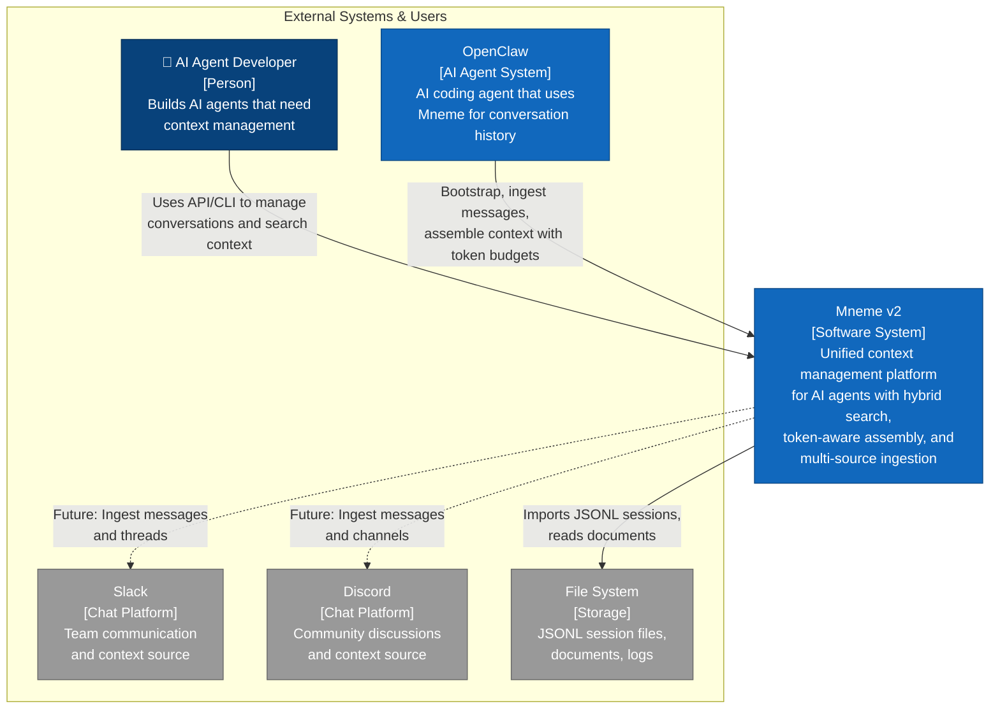
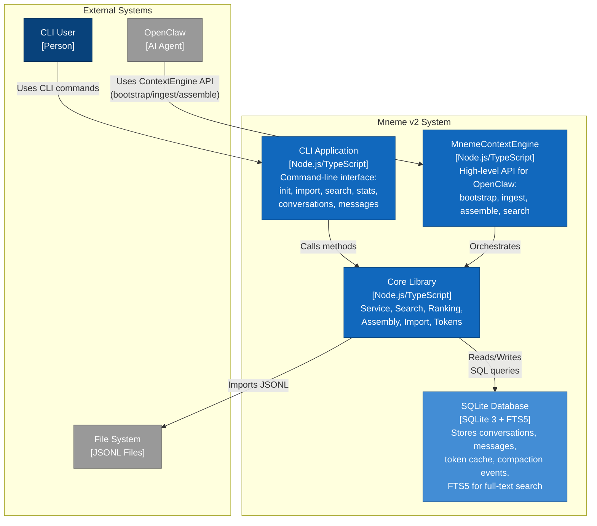
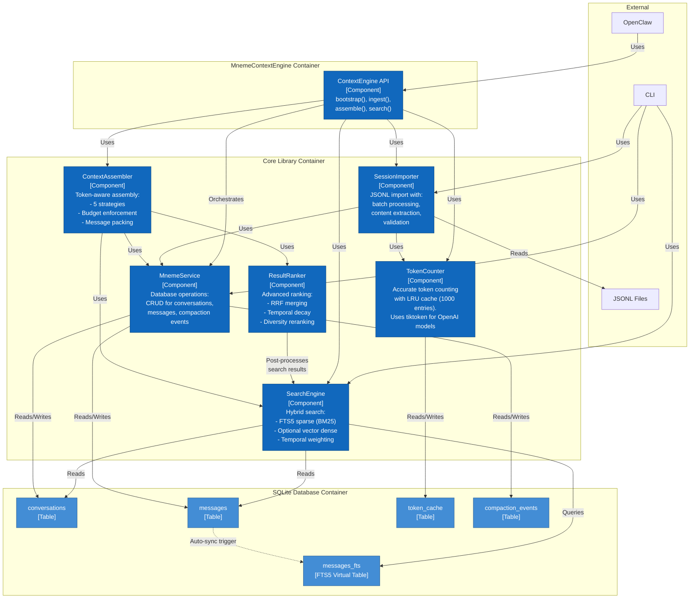
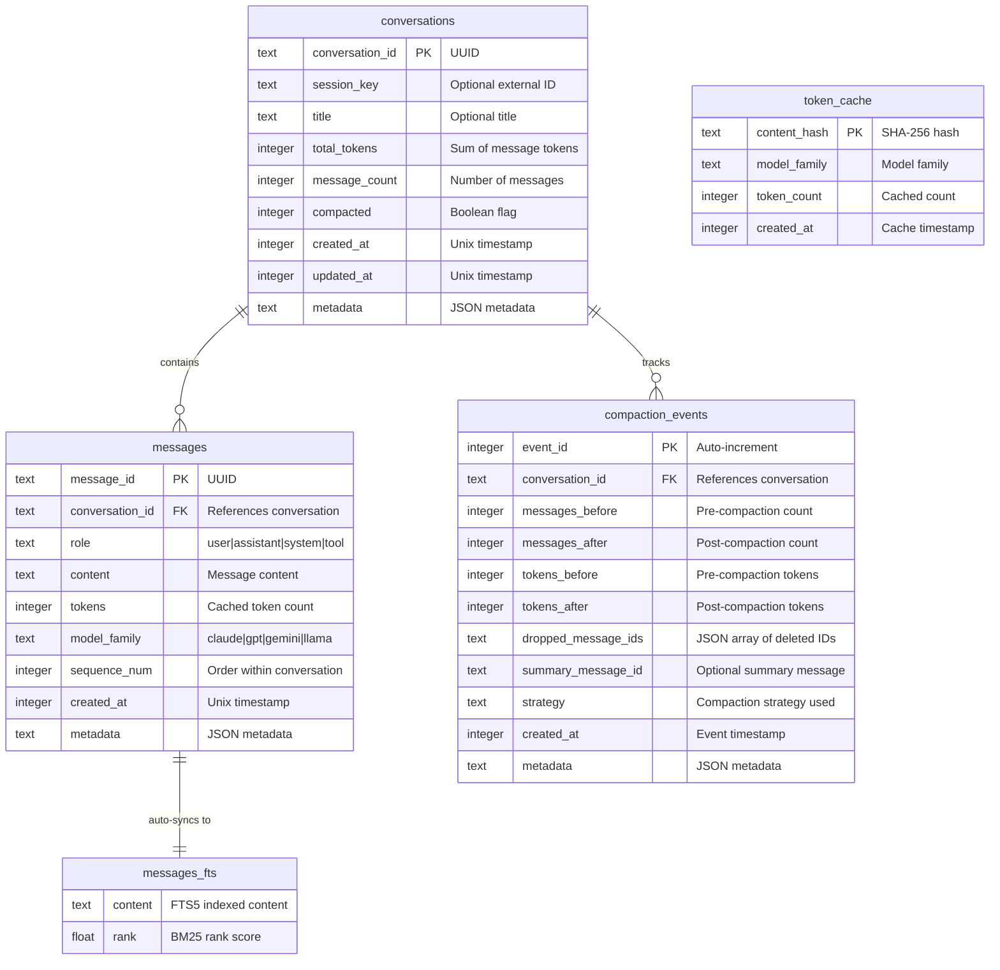
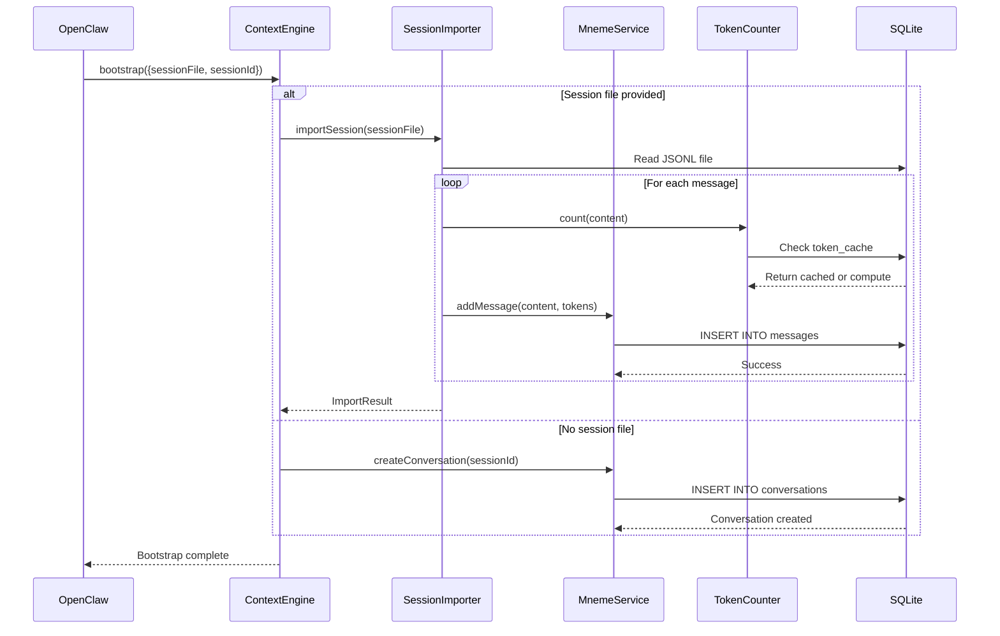
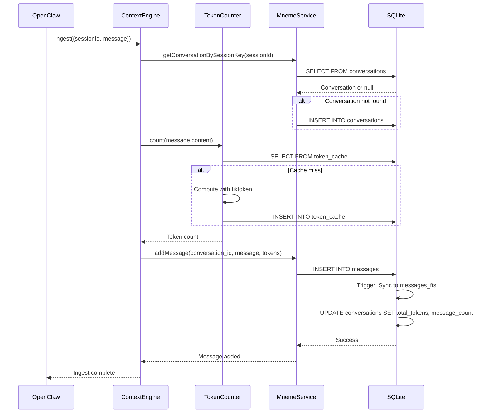
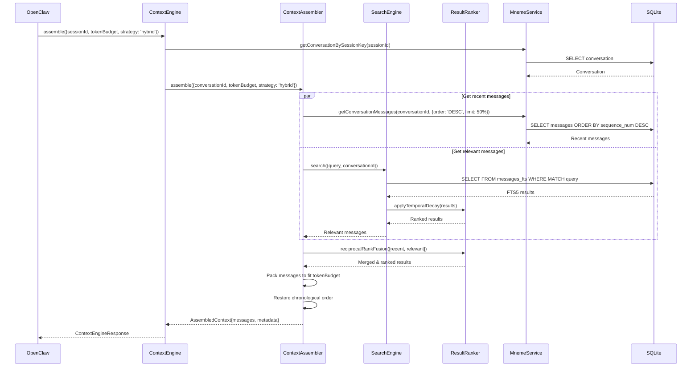
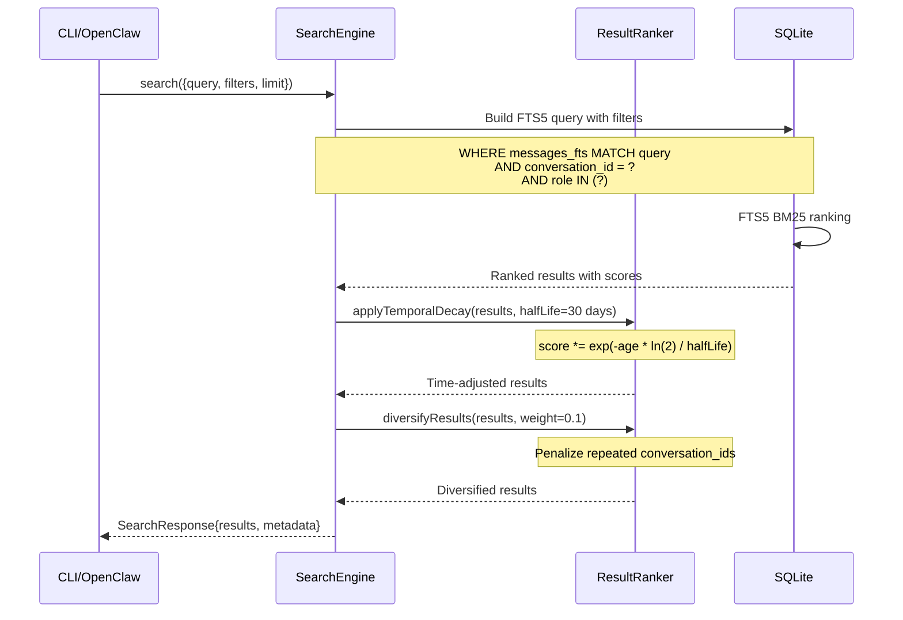

# Mneme v2 - C4 Architecture Diagrams

**Date**: March 22, 2026
**Version**: 2.0
**Status**: Implemented

## Overview

This document provides C4 (Context, Container, Component, Code) architecture diagrams for Mneme v2, a unified context management platform for AI agents. The diagrams follow the C4 model methodology to visualize the system at different levels of abstraction.

---

## Level 1: System Context Diagram

Shows how Mneme fits into the overall system landscape and its relationships with external entities.



### Key Relationships

| From | To | Description |
|------|----|-----------|
| AI Agent Developer | Mneme | Uses CLI and API to manage conversations, import data, and search |
| OpenClaw | Mneme | Uses ContextEngine API for bootstrap, ingest, and assemble operations |
| Mneme | File System | Imports JSONL session files and reads documents |
| Mneme | Slack/Discord | Future integrations for message ingestion (not yet implemented) |

---

## Level 2: Container Diagram

Shows the high-level technology choices and how containers communicate.



### Container Descriptions

**MnemeContextEngine** (Node.js/TypeScript Container)
- High-level API designed for OpenClaw integration
- Methods: `bootstrap()`, `ingest()`, `assemble()`, `search()`
- Orchestrates core library components
- Manages session lifecycle

**CLI Application** (Node.js/TypeScript Container)
- Command-line interface for developers
- Commands: init, import, search, stats, conversations, messages, export, health, vacuum
- Direct access to core library functionality
- Interactive and scriptable

**Core Library** (Node.js/TypeScript Container)
- Six main components: Service, Search, Ranking, Assembly, Import, Tokens
- Implements all business logic
- Direct database access
- Stateless and composable

**SQLite Database** (SQLite Container)
- Single-file database with WAL mode
- FTS5 extension for full-text search
- Tables: conversations, messages, token_cache, compaction_events
- Auto-sync triggers for FTS5
- ACID transactions

---

## Level 3: Component Diagram

Shows the internal components of the Core Library and their interactions.



### Component Descriptions

#### 1. MnemeService
**Responsibility**: Core database service providing CRUD operations

**Key Methods**:
- `createConversation()`, `getConversation()`, `updateConversation()`
- `addMessage()`, `getConversationMessages()`, `deleteMessages()`
- `recordCompaction()`, `getCompactionHistory()`
- `getStats()`, `healthCheck()`

**Dependencies**: SQLite database (conversations, messages, compaction_events tables)

**Implementation**: ~420 lines, src/core/service.ts

---

#### 2. TokenCounter
**Responsibility**: Accurate token counting with caching

**Key Methods**:
- `count(content, options)` - Count tokens for a single text
- `countBatch(contents, options)` - Batch token counting
- `getCacheStats()` - Cache hit/miss statistics

**Features**:
- LRU cache (1000 entries) for token counts
- SHA-256 content hashing for cache keys
- Model family detection (claude, gpt, gemini, llama)
- Uses tiktoken for OpenAI models
- ~1ms cached lookup, ~5-10ms uncached

**Dependencies**: SQLite (token_cache table)

**Implementation**: ~215 lines, src/core/tokens.ts

---

#### 3. SessionImporter
**Responsibility**: Import JSONL session files into database

**Key Methods**:
- `importSession(options)` - Import single JSONL file
- `importDirectory(path)` - Batch import all JSONL files
- `verifyImport(conversationId)` - Validate import integrity

**Features**:
- OpenClaw JSONL format support
- Content block extraction (handles both string and array content)
- Batch processing (configurable batch size)
- Progress callbacks
- Error handling for malformed JSON
- Timestamp preservation

**Dependencies**: MnemeService, TokenCounter

**Implementation**: ~300 lines, src/core/import.ts

---

#### 4. SearchEngine
**Responsibility**: Hybrid search across conversation history

**Key Methods**:
- `search(options)` - Execute hybrid search
- `sparseSearch()` - FTS5 full-text search (BM25-like)
- `hybridSearch()` - Combine sparse + dense vectors
- `hasVectorSupport()` - Check for vector extension

**Features**:
- FTS5 sparse search (BM25 ranking)
- Optional dense vector search (not yet implemented)
- Temporal recency weighting
- Filters: conversation, role, time range, min tokens
- Pagination (limit, offset)
- Configurable score weights

**Search Modes**:
- `sparse`: FTS5 only (default, always available)
- `hybrid`: FTS5 + vector (requires vector extension)

**Performance Targets**:
- Keyword search @ 100K messages: <20ms P50
- Hybrid search @ 100K messages: <80ms P50

**Dependencies**: SQLite (messages_fts FTS5 table)

**Implementation**: ~315 lines, src/core/search.ts

---

#### 5. ResultRanker
**Responsibility**: Advanced result ranking and reranking

**Key Methods**:
- `reciprocalRankFusion(resultSets, k)` - Merge multiple result sets using RRF
- `applyTemporalDecay(results, halfLife)` - Exponential time-based decay
- `diversifyResults(results, weight)` - Penalize repeated conversations
- `calculateMRR(results, relevantIds)` - Mean Reciprocal Rank metric
- `calculateNDCG(results, relevanceScores, k)` - Normalized DCG metric
- `rerank(results, options)` - Complete reranking pipeline

**Algorithms**:
- **RRF**: `score = Σ(1 / (k + rank))` where k=60 (default)
- **Temporal Decay**: `score *= exp(-age * ln(2) / halfLife)`
- **Diversity**: Penalize repeated conversation IDs

**Features**:
- Batch ranking for multiple queries
- Conversation-aware grouping
- Configurable weights for decay and diversity
- Ranking explanations with score breakdowns

**Dependencies**: SearchEngine (consumes SearchResult[])

**Implementation**: ~280 lines, src/core/ranking.ts

---

#### 6. ContextAssembler
**Responsibility**: Assemble conversation context within token budgets

**Key Methods**:
- `assemble(options)` - Main assembly with strategy selection
- `assembleRecent()` - Most recent messages
- `assembleRelevant()` - Search-based relevance
- `assembleHybrid()` - Mix of recent + relevant
- `assembleSlidingWindow()` - Fixed window of recent
- `assembleFull()` - All messages (may exceed budget)

**Assembly Strategies**:
1. **recent**: Most recent messages first (default for chat)
2. **relevant**: Search-based relevance (requires query)
3. **hybrid**: 50% recent + 50% relevant (balanced)
4. **sliding-window**: Fixed recent window (predictable)
5. **full**: All messages (for export/debugging)

**Features**:
- Token budget enforcement
- Preserves chronological order
- Optional system message filtering
- Preserves N most recent messages (configurable)
- Returns metadata (tokens used, truncation status)

**Token Packing Algorithm**:
```
1. Fetch messages based on strategy
2. Sort by priority (strategy-dependent)
3. Pack messages until budget exhausted
4. Restore chronological order
5. Return with metadata
```

**Dependencies**: MnemeService, SearchEngine, ResultRanker

**Implementation**: ~380 lines, src/core/assembly.ts

---

## Database Schema



### Key Database Features

1. **FTS5 Full-Text Search**
   - Virtual table `messages_fts` auto-synced with `messages`
   - BM25-like ranking for relevance
   - Triggers for INSERT, UPDATE, DELETE maintain sync

2. **Token Caching**
   - SHA-256 content hashing prevents duplicate counting
   - LRU eviction (1000 entry limit)
   - ~90%+ cache hit rate in typical usage

3. **Compaction Audit Trail**
   - Complete history of message deletions
   - Tracks tokens saved
   - Supports debugging and analytics

4. **WAL Mode**
   - Concurrent reads during writes
   - Better performance than rollback journal
   - Atomicity for batch operations

---

## Data Flow Diagrams

### Bootstrap Flow



### Ingest Flow



### Assemble Flow (Hybrid Strategy)



### Search Flow



---

## Technology Stack

### Runtime
- **Node.js**: ≥22.0.0
- **TypeScript**: 5.6+
- **Package Manager**: npm

### Core Dependencies
- **better-sqlite3**: 11.0.0 - Native SQLite bindings
- **tiktoken**: (via dynamic import) - OpenAI token counting
- **crypto**: (built-in) - SHA-256 hashing

### Database
- **SQLite**: 3.x with FTS5 extension
- **WAL Mode**: Concurrent read/write
- **FTS5**: Full-text search with BM25 ranking

### Development
- **Vitest**: 2.0+ - Testing framework
- **TypeScript ESLint**: 8.0+ - Linting
- **Prettier**: 3.3+ - Code formatting
- **tsx**: 4.19+ - TypeScript execution

### Testing
- **Coverage**: v8 provider, 75.64% achieved
- **Test Count**: 66 passing tests
- **Fixtures**: JSONL session files, mock generators
- **Benchmarks**: Performance timing utilities

---

## Performance Characteristics

### Token Counting
- **Cached**: <1ms (90%+ hit rate)
- **Uncached**: 5-10ms per message
- **Batch**: ~200 messages/second

### Search (Target @ 100K messages)
- **Keyword (FTS5)**: <20ms P50, <30ms P95
- **Hybrid**: <80ms P50, <120ms P95
- **Cold start**: First query ~2x slower (index cache)

### Import
- **Throughput**: >200 messages/second
- **Per-message**: <5ms (including token counting)
- **Batch size**: 100 messages (configurable)

### Assembly
- **Recent strategy**: <10ms for 1000 messages
- **Hybrid strategy**: <100ms (includes search)
- **Token packing**: O(n) linear scan

### Database
- **Size**: ~1KB per message (average)
- **100K messages**: ~100MB database
- **FTS5 index**: ~30% overhead
- **Vacuum**: Recommended after bulk deletes

---

## Security Considerations

### Database
- ✅ Parameterized queries (SQL injection protection)
- ✅ Foreign key constraints
- ✅ Transaction rollback on errors
- ✅ ACID guarantees

### Content
- ⚠️ No encryption at rest (SQLite file is plaintext)
- ⚠️ No access control (single-user design)
- ✅ Content hashing for integrity (SHA-256)

### Token Counting
- ✅ No external API calls (offline tiktoken)
- ✅ Deterministic results (cached)
- ⚠️ Cache poisoning possible if DB is tampered

### Recommendations for Production
1. Encrypt database file at rest (OS-level or SQLite extension)
2. Implement access control if multi-tenant
3. Validate/sanitize user input for search queries
4. Rate limit search operations
5. Backup database regularly

---

## Deployment Models

### 1. Embedded Library (Current)
```
AI Agent Process
└── Mneme Library
    └── SQLite Database (in-memory or file)
```

**Use Cases**: OpenClaw integration, desktop AI agents
**Pros**: Simple, no network overhead, ACID guarantees
**Cons**: Single process only, no horizontal scaling

### 2. CLI Tool (Current)
```
Terminal
└── mneme CLI
    └── SQLite Database (file)
```

**Use Cases**: Data import, debugging, scripting
**Pros**: Scriptable, human-friendly
**Cons**: Manual operation

### 3. Future: Client-Server (Planned)
```
Multiple AI Agents
└── REST/gRPC API
    └── Mneme Server
        └── SQLite/PostgreSQL Database
```

**Use Cases**: Multi-agent systems, web services
**Pros**: Horizontal scaling, multi-tenant
**Cons**: Network latency, complexity

---

## Extension Points

### 1. Vector Search
**Status**: Interface defined, not implemented
**Location**: src/core/search.ts `hybridSearch()`
**Requirements**: SQLite vector extension (e.g., sqlite-vss)

### 2. Additional Data Sources
**Status**: Template available
**Location**: test/integration/channels/channel-adapter.test.ts
**Planned**: Slack, Discord, Google Chat, Email

### 3. Compaction Strategies
**Status**: Audit trail exists, strategies not implemented
**Location**: src/core/service.ts `recordCompaction()`
**Planned**: LRU, importance-based, summary-based

### 4. Custom Rankers
**Status**: Pluggable architecture
**Location**: src/core/ranking.ts
**Extensions**: Learning-to-rank, user feedback, domain-specific

### 5. API Server
**Status**: Not implemented
**Dependencies**: Express/Hono (already in package.json)
**Endpoints**: REST or gRPC for remote access

---

## Version History

| Version | Date | Changes |
|---------|------|---------|
| 2.0 | 2026-03-22 | C4 diagrams created, comprehensive architecture documentation |
| 2.0 | 2026-03-21 | Initial v2 implementation complete |
| 1.0 | Earlier | v1 design (deprecated) |

---

## References

- [Mneme v2 Implementation Plan](./mneme-v2-plan.md)
- [Implementation Summary](./IMPLEMENTATION_SUMMARY.md)
- [Test README](../../test/README.md)
- [C4 Model](https://c4model.com/)
- [Mermaid Documentation](https://mermaid.js.org/)

---

**Document maintained by**: Claude Sonnet 4.5
**Last updated**: 2026-03-22
