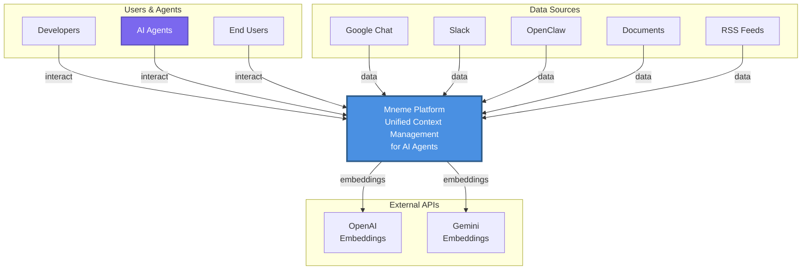
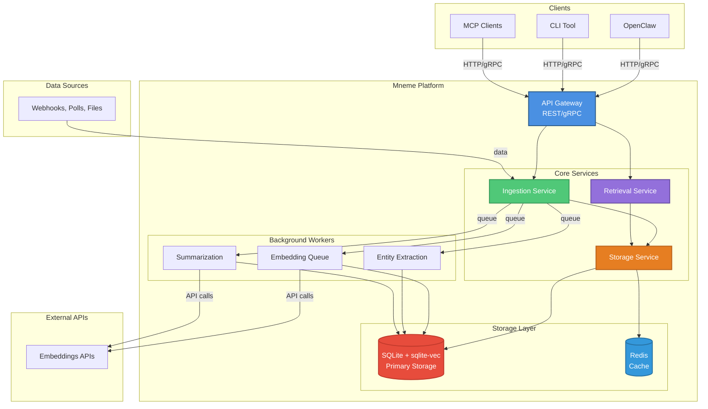
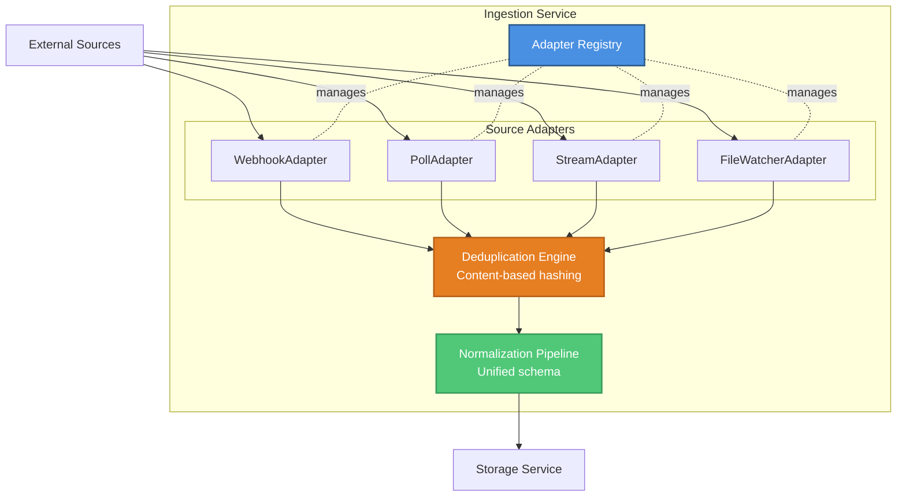
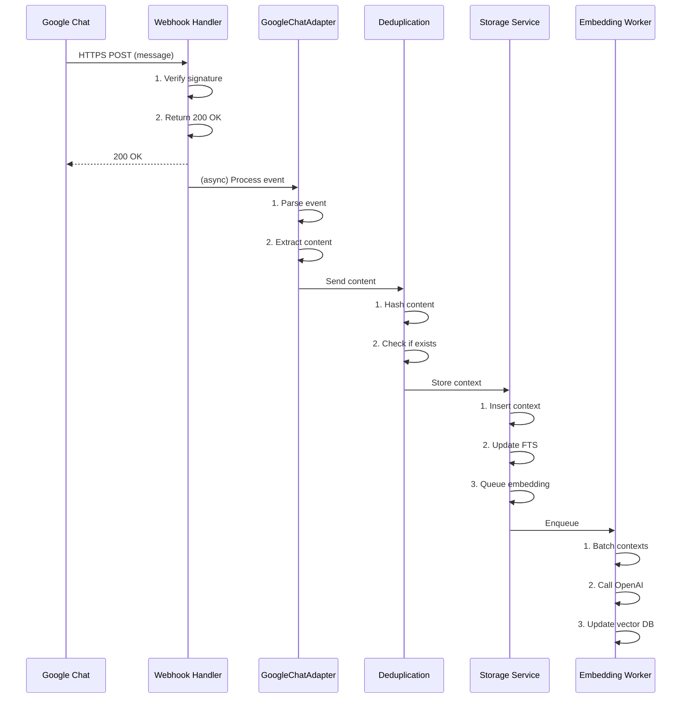
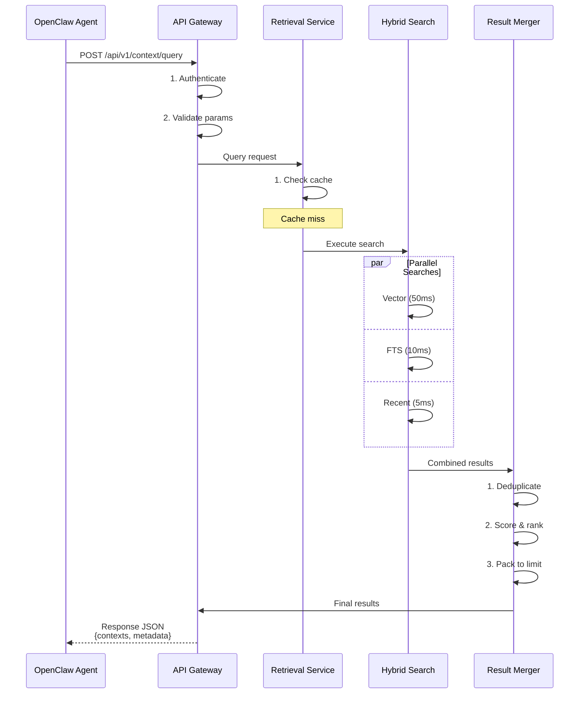
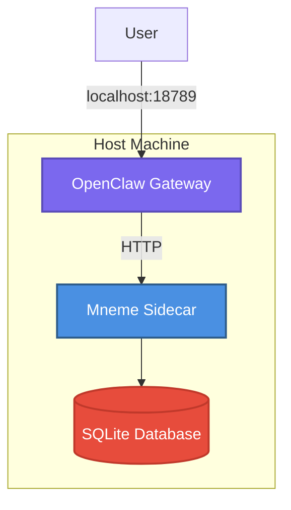
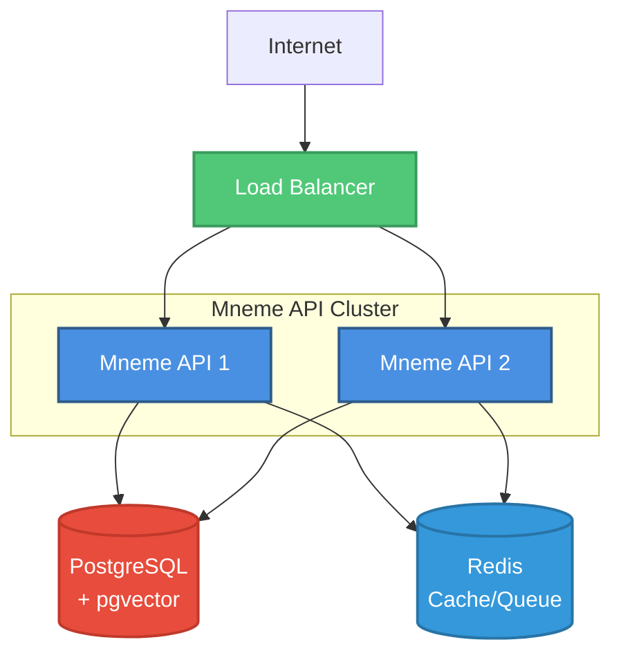

# Mneme - High-Level Design (HLD)

**Version**: 1.0
**Date**: March 21, 2026
**Status**: Draft
**Owner**: Engineering

---

## Table of Contents

1. [Architecture Overview](#architecture-overview)
2. [Component Design](#component-design)
3. [Data Flow](#data-flow)
4. [Storage Design](#storage-design)
5. [API Design](#api-design)
6. [Deployment Architecture](#deployment-architecture)
7. [Security Model](#security-model)
8. [Scalability & Performance](#scalability--performance)

---

## Architecture Overview

### System Context (C4 Level 1)



**Key Relationships**:
- Users interact with Mneme via AI agents (OpenClaw, custom agents)
- Mneme ingests data from multiple sources (chat, docs, feeds)
- Mneme uses external APIs for embeddings (OpenAI, Gemini)

---

### Container Diagram (C4 Level 2)



---

## Component Design

### 1. API Gateway

**Responsibility**: External interface, authentication, rate limiting

**Technology**: Node.js + Express (REST), gRPC for high-performance clients

**Endpoints**:
```typescript
// REST API
POST   /api/v1/context/query       // Query context
POST   /api/v1/context/ingest      // Ingest new context
GET    /api/v1/sources              // List sources
POST   /api/v1/sources              // Add source
DELETE /api/v1/sources/:id          // Remove source
GET    /api/v1/stats                // Platform stats

// Webhooks (ingestion)
POST   /webhooks/google-chat
POST   /webhooks/slack
POST   /webhooks/github
```

**Key Features**:
- JWT authentication
- Rate limiting (token bucket)
- Request validation (Zod schemas)
- CORS support

---

### 2. Ingestion Service

**Responsibility**: Collect context from heterogeneous sources

**Architecture**:


**Adapters** (Pluggable):
- **GoogleChatAdapter**: Webhook-based, real-time
- **SlackAdapter**: Webhook-based, real-time
- **OpenClawSessionAdapter**: File watcher, near-realtime
- **RSSAdapter**: Poll-based, hourly
- **FileSystemAdapter**: File watcher, for documents

**Data Flow**:
1. Source sends event (webhook, poll result, file change)
2. Adapter receives event, converts to unified format
3. Deduplication engine checks content hash
4. Normalization pipeline enriches metadata
5. Batch insert to storage

---

### 3. Storage Service

**Responsibility**: Persist context, manage indexes

**Schema**:
```sql
-- Messages table
CREATE TABLE contexts (
  id TEXT PRIMARY KEY,
  content_hash TEXT NOT NULL,
  content TEXT NOT NULL,
  source_id TEXT NOT NULL,
  source_type TEXT NOT NULL,
  timestamp INTEGER NOT NULL,
  created_at INTEGER NOT NULL,
  metadata JSON,

  UNIQUE(content_hash, source_id)
);

-- Full-text search
CREATE VIRTUAL TABLE contexts_fts USING fts5(
  content,
  content=contexts
);

-- Vector search
CREATE VIRTUAL TABLE contexts_vec USING vec0(
  embedding FLOAT[1536]
);

-- Indexes
CREATE INDEX idx_timestamp ON contexts(timestamp DESC);
CREATE INDEX idx_source ON contexts(source_id, source_type);
CREATE INDEX idx_hash ON contexts(content_hash);
```

**Indexing Pipeline**:
```
New Context
    │
    ├─▶ FTS Index (sync, <10ms)
    │
    ├─▶ Metadata Index (sync, <5ms)
    │
    └─▶ Embedding Queue (async, ~30s)
            │
            ▼
        Batch Embed (100 at a time)
            │
            ▼
        Vector Index Update
```

---

### 4. Retrieval Service

**Responsibility**: Intelligent context retrieval

**Algorithm** (Hybrid Search):
```typescript
async function hybridSearch(query: string, options: SearchOptions) {
  // 1. Parallel search across indexes
  const [vectorResults, ftsResults, recentResults] = await Promise.all([
    // Semantic search
    vectorIndex.search(await embed(query), { k: 20 }),

    // Keyword search
    ftsIndex.search(query, { k: 20 }),

    // Recent messages
    metadataIndex.query({
      where: { timestamp: { gte: Date.now() - 86400000 } },
      orderBy: 'timestamp DESC',
      limit: 10
    })
  ]);

  // 2. Merge with weighted scoring
  const merged = mergeResults({
    vector: { results: vectorResults, weight: 0.5 },
    fts: { results: ftsResults, weight: 0.3 },
    recency: { results: recentResults, weight: 0.2 }
  });

  // 3. Deduplicate (same context from multiple indexes)
  const unique = deduplicateByContentHash(merged);

  // 4. Rank by composite score
  const ranked = rankByScore(unique);

  // 5. Pack into token budget
  const packed = packToTokenLimit(ranked, options.maxTokens);

  return packed;
}
```

**Scoring Function**:
```typescript
function calculateScore(context: Context, query: string): number {
  let score = 0;

  // Semantic similarity (0-1)
  score += context.vectorScore * 0.5;

  // Keyword match (0-1)
  score += context.ftsScore * 0.3;

  // Recency boost (exponential decay)
  const ageDays = (Date.now() - context.timestamp) / 86400000;
  score += Math.exp(-ageDays / 30) * 0.2;

  return score;
}
```

---

### 5. Background Workers

**Responsibility**: Async processing (embeddings, extraction)

**Workers**:

1. **Embedding Worker**
   - Pulls from queue (Redis or in-memory)
   - Batches up to 100 contexts
   - Calls OpenAI/Gemini API
   - Updates vector index
   - Priority: Recent contexts first

2. **Entity Extraction Worker**
   - Extracts people, dates, URLs, emails
   - Builds knowledge graph
   - Low priority (nice-to-have)

3. **Summarization Worker**
   - Auto-generates summaries for long documents
   - Uses LLM (Claude, GPT-4)
   - Lowest priority

---

## Data Flow

### Ingestion Flow



**Latency Breakdown**:
- Webhook to 200 OK: <50ms
- Deduplication: <10ms
- Storage insert: <20ms
- FTS index update: <10ms
- Embedding (async): ~30s (not blocking)

**Total user-visible latency**: <100ms

---

### Query Flow



**Latency Breakdown**:
- Auth & validation: <10ms
- Cache check: <5ms
- Vector search: ~50ms
- FTS search: ~10ms
- Metadata query: ~5ms
- Merge & rank: ~20ms

**Total p95 latency**: <120ms (with cache), <150ms (without cache)

---

## Storage Design

### Primary Storage: SQLite + sqlite-vec

**Why SQLite?**
- ✅ Zero configuration
- ✅ Single file (easy backup)
- ✅ Fast (millions of rows, sub-100ms queries)
- ✅ Embedded (no network latency)
- ✅ ACID transactions

**Schema** (Full):
```sql
-- Main context table
CREATE TABLE contexts (
  id TEXT PRIMARY KEY,
  content_hash TEXT NOT NULL,
  content TEXT NOT NULL,
  raw_content TEXT,
  summary TEXT,

  -- Source
  source_id TEXT NOT NULL,
  source_type TEXT NOT NULL,
  source_external_id TEXT,
  source_url TEXT,

  -- Temporal
  timestamp INTEGER NOT NULL,
  created_at INTEGER NOT NULL,
  updated_at INTEGER NOT NULL,

  -- Relationships
  thread_id TEXT,
  parent_id TEXT,
  conversation_id TEXT NOT NULL,

  -- Metadata (JSON)
  metadata JSON,

  -- Indexing flags
  indexed_vector BOOLEAN DEFAULT 0,
  indexed_fts BOOLEAN DEFAULT 0,

  -- Provenance
  provenance JSON,

  UNIQUE(content_hash, source_id)
);

-- FTS5 full-text index
CREATE VIRTUAL TABLE contexts_fts USING fts5(
  content,
  author,
  content=contexts,
  content_rowid=rowid
);

-- Vector index (sqlite-vec)
CREATE VIRTUAL TABLE contexts_vec USING vec0(
  embedding FLOAT[1536]
);

-- Mapping table (context ID -> vector rowid)
CREATE TABLE context_vectors (
  context_id TEXT PRIMARY KEY,
  vector_rowid INTEGER,
  embedding_model TEXT,
  created_at INTEGER,

  FOREIGN KEY (context_id) REFERENCES contexts(id)
);

-- Indexes for common queries
CREATE INDEX idx_contexts_timestamp ON contexts(timestamp DESC);
CREATE INDEX idx_contexts_source ON contexts(source_id, source_type);
CREATE INDEX idx_contexts_conversation ON contexts(conversation_id);
CREATE INDEX idx_contexts_hash ON contexts(content_hash);
CREATE INDEX idx_contexts_indexed ON contexts(indexed_vector, indexed_fts);

-- Cursors for incremental collection
CREATE TABLE collection_cursors (
  source_id TEXT PRIMARY KEY,
  last_message_id TEXT,
  last_timestamp INTEGER,
  checkpoint JSON,
  updated_at INTEGER
);

-- Adapter registry
CREATE TABLE adapters (
  id TEXT PRIMARY KEY,
  type TEXT NOT NULL, -- webhook | poll | stream
  config JSON,
  status TEXT, -- active | paused | error
  last_run_at INTEGER,
  created_at INTEGER
);
```

---

### Cache Layer: Redis (Optional)

**Use Cases**:
- Query result caching (TTL: 5 minutes)
- Embedding queue
- Rate limiting counters

**Example**:
```typescript
// Cache query results
const cacheKey = `query:${sha256(query + JSON.stringify(options))}`;
const cached = await redis.get(cacheKey);

if (cached) {
  return JSON.parse(cached);
}

const results = await hybridSearch(query, options);
await redis.setex(cacheKey, 300, JSON.stringify(results)); // 5 min TTL
return results;
```

---

## API Design

### REST API Specification

#### POST /api/v1/context/query

**Request**:
```json
{
  "query": "What did Alice say about API deadlines?",
  "maxTokens": 4000,
  "sources": ["google-chat", "slack", "openclaw-session"],
  "timeRange": {
    "start": 1710979200000,
    "end": 1711065600000
  },
  "conversationId": "project-alpha",
  "filters": {
    "author": "alice@example.com"
  }
}
```

**Response**:
```json
{
  "contexts": [
    {
      "id": "ctx-abc123",
      "content": "API shipping target is Friday",
      "score": 0.95,
      "source": {
        "type": "slack",
        "id": "slack-1",
        "externalId": "msg-456",
        "url": "https://slack.com/archives/C123/p456"
      },
      "timestamp": 1710979200000,
      "metadata": {
        "author": "alice@example.com",
        "channel": "#engineering"
      }
    }
  ],
  "metadata": {
    "totalScanned": 1500,
    "strategy": "hybrid",
    "latencyMs": 142,
    "tokenCount": 850
  }
}
```

---

#### POST /api/v1/context/ingest

**Request**:
```json
{
  "contexts": [
    {
      "content": "Meeting at 3pm tomorrow",
      "source": {
        "type": "google-chat",
        "externalId": "msg-789"
      },
      "timestamp": 1711065600000,
      "metadata": {
        "author": "bob@example.com"
      }
    }
  ]
}
```

**Response**:
```json
{
  "ingested": 1,
  "deduplicated": 0,
  "errors": []
}
```

---

## Deployment Architecture

### MVP: Sidecar Pattern



**docker-compose.yml**:
```yaml
version: '3.8'

services:
  openclaw:
    image: openclaw/openclaw:latest
    environment:
      MNEME_ENDPOINT: http://mneme:8080
    depends_on:
      - mneme

  mneme:
    image: mneme/mneme:latest
    volumes:
      - ./data:/data
    ports:
      - "8080:8080"
    environment:
      MNEME_STORAGE: sqlite
      MNEME_DB_PATH: /data/mneme.db
```

---

### Production: Standalone Service



---

## Security Model

### Authentication

```typescript
// JWT-based auth
interface AuthToken {
  userId: string;
  scopes: string[]; // ['query', 'ingest', 'admin']
  exp: number;
}

// Middleware
async function authenticate(req: Request): Promise<User> {
  const token = req.headers.authorization?.replace('Bearer ', '');
  const decoded = jwt.verify(token, SECRET_KEY);
  return getUserById(decoded.userId);
}
```

### Authorization (RBAC)

```typescript
interface AccessPolicy {
  userId: string;
  sources: {
    [sourceId: string]: {
      read: boolean;
      write: boolean;
    };
  };
}

// Example: User can only query their own sources
async function enforcePolicy(userId: string, sourceIds: string[]) {
  const policy = await getPolicy(userId);

  const allowed = sourceIds.filter(
    id => policy.sources[id]?.read === true
  );

  return allowed;
}
```

### Data Privacy

- **At Rest**: SQLite database file permissions (0600)
- **In Transit**: HTTPS only (TLS 1.3)
- **Webhook Verification**: HMAC signatures
- **No External Leakage**: Embeddings generated, but original content stays local

---

## Scalability & Performance

### Capacity Estimates

| Users | Messages/Day | Storage | QPS | Resources |
|-------|--------------|---------|-----|-----------|
| 100 | 100K | 10GB | 10 | 2 CPU, 4GB RAM |
| 1K | 1M | 100GB | 100 | 4 CPU, 8GB RAM |
| 10K | 10M | 1TB | 1K | 8 CPU, 16GB RAM |

### Bottleneck Analysis

**Most Expensive Operations**:
1. **Embedding generation**: 50-100ms per message (OpenAI API)
   - **Solution**: Async queue, batch processing
2. **Vector search**: 20-50ms for 1M vectors
   - **Solution**: ANN index (HNSW in sqlite-vec), caching
3. **FTS search**: 5-10ms
   - **Solution**: Already fast, add query caching

### Optimization Strategies

1. **Query Caching**: 80% cache hit rate → 5x speedup
2. **Batch Embeddings**: 100 messages at once → 10x cheaper
3. **Incremental Indexing**: Only embed new content → 100x less work
4. **ANN Indexing**: HNSW vs brute-force → 1000x faster for large datasets

---

## Appendix: Technology Choices

| Component | Technology | Rationale |
|-----------|------------|-----------|
| **Runtime** | Node.js 22+ | OpenClaw ecosystem, async I/O |
| **Language** | TypeScript | Type safety, developer experience |
| **API Framework** | Express.js | Simple, mature, widely used |
| **Storage** | SQLite + sqlite-vec | Zero config, fast, embedded |
| **FTS** | FTS5 (SQLite) | Built-in, performant |
| **Vector DB** | sqlite-vec | Embedded, no external deps |
| **Queue** | BullMQ (optional) | Redis-backed, robust |
| **Embeddings** | OpenAI API | Best quality (configurable) |
| **Testing** | Vitest | Fast, modern |

---

**Next Steps**: Proceed to [Technical RFC](../rfc/mneme-rfc.md)
