# C4 Architecture Diagrams for Mneme

This document contains C4 model diagrams (Context, Containers, Components, Code) for the Mneme platform using Mermaid syntax.

---

## Level 1: System Context Diagram

**Purpose**: Show how Mneme fits into the larger ecosystem

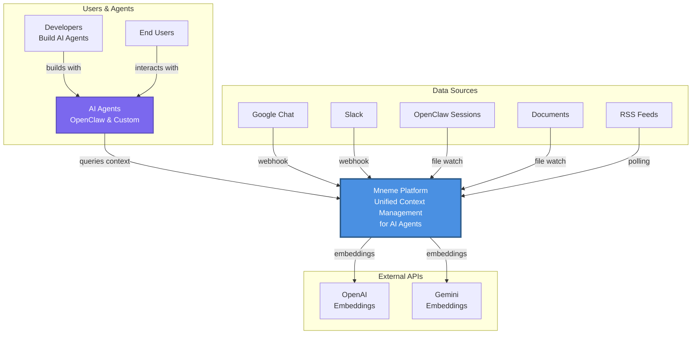

**Key Relationships**:
- **Developers** build AI agents that use Mneme for context
- **AI Agents** query Mneme for relevant context
- **Mneme** ingests from multiple data sources
- **Mneme** uses external APIs for embeddings

---

## Level 2: Container Diagram

**Purpose**: Show the major containers (applications/services) within Mneme

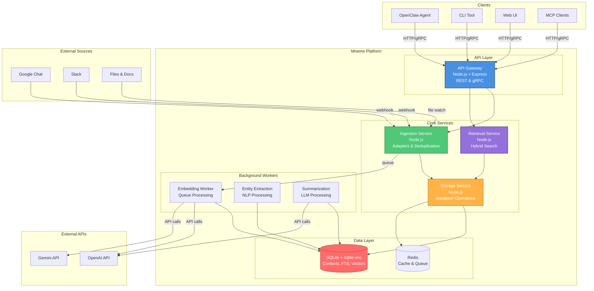

---

## Level 3: Component Diagram - Ingestion Service

**Purpose**: Show internal components of the Ingestion Service

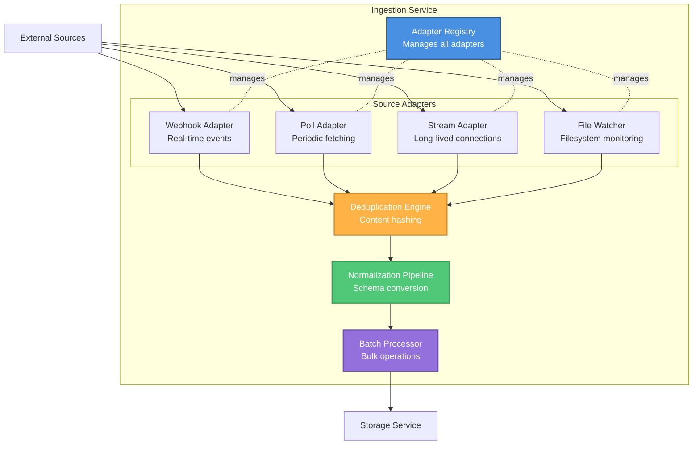

**Component Responsibilities**:
1. **Adapter Registry**: Lifecycle management of all adapters
2. **Source Adapters**: Collect from different sources (webhook, poll, stream, files)
3. **Deduplication Engine**: Compute content hashes, check for duplicates
4. **Normalization Pipeline**: Convert to unified `StoredContext` schema
5. **Batch Processor**: Bulk insert to storage, queue embeddings

---

## Level 3: Component Diagram - Retrieval Service

**Purpose**: Show internal components of the Retrieval Service

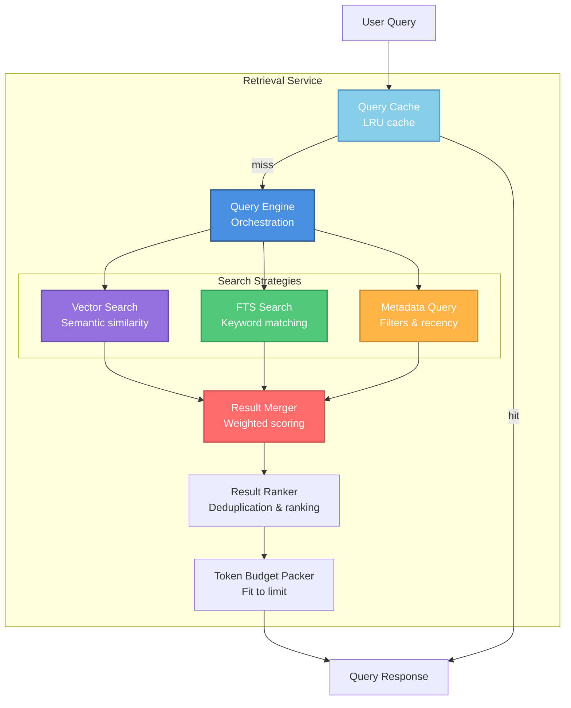

**Search Algorithm**:
1. **Query Engine**: Coordinate parallel searches
2. **Vector Search**: Semantic similarity using embeddings
3. **FTS Search**: Keyword-based full-text search
4. **Metadata Query**: Filter by author, time, source
5. **Result Merger**: Combine with weighted scores (vector: 0.5, fts: 0.3, recency: 0.2)
6. **Result Ranker**: Deduplicate by content hash, rank by composite score
7. **Token Packer**: Fit results into maxTokens budget

---

## Level 4: Code Diagram - Adapter Class Hierarchy

**Purpose**: Show class structure for adapters

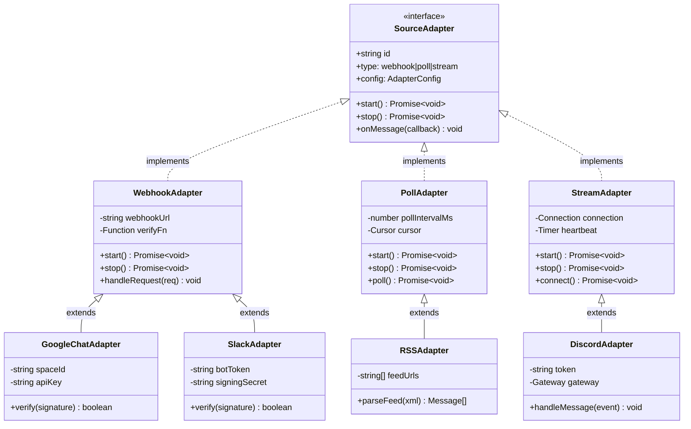

---

## Sequence Diagram - Ingestion Flow (Webhook)

**Purpose**: Show message flow from source to storage

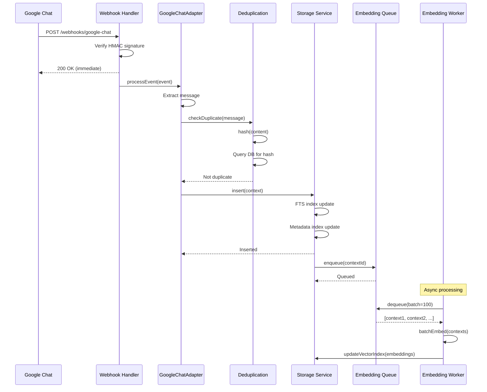

**Latency Breakdown**:
- Webhook to 200 OK: **<50ms**
- Deduplication: **<10ms**
- Storage insert: **<20ms**
- FTS update: **<10ms**
- Queue: **<5ms**
- **Total user-visible**: **<100ms**
- Embedding (async): **~30s** (not blocking)

---

## Sequence Diagram - Query Flow (Hybrid Search)

**Purpose**: Show query processing pipeline

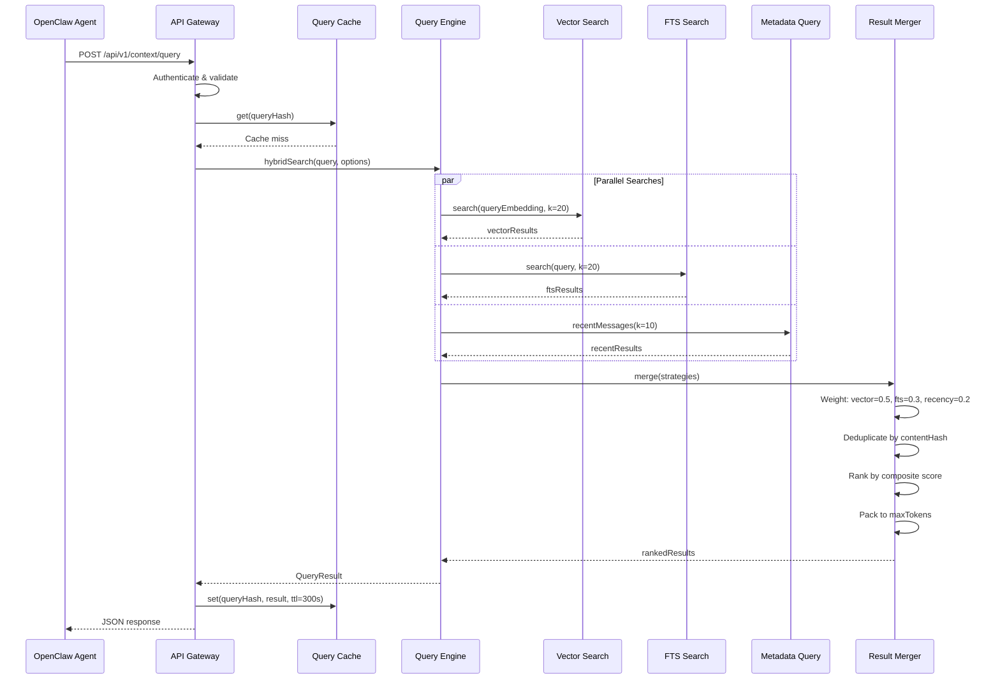

**Latency Breakdown**:
- Auth & validation: **<10ms**
- Cache check: **<5ms**
- Vector search: **~50ms**
- FTS search: **~10ms**
- Metadata query: **~5ms**
- Merge & rank: **~20ms**
- **Total p95**: **<120ms** (cached), **<150ms** (uncached)

---

## Deployment Diagram - MVP (Sidecar)

**Purpose**: Show Docker Compose deployment

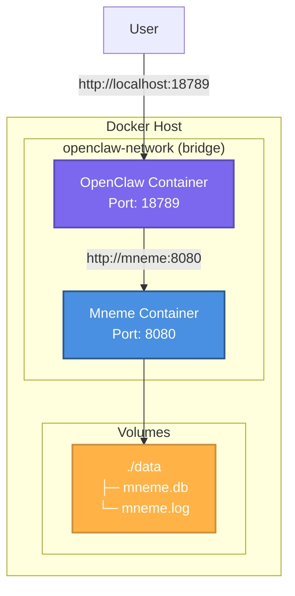

**docker-compose.yml**:
```yaml
services:
  openclaw:
    image: openclaw/openclaw:latest
    environment:
      MNEME_ENDPOINT: http://mneme:8080
    depends_on:
      - mneme

  mneme:
    image: mneme/mneme:latest
    volumes:
      - ./data:/data
    ports:
      - "8080:8080"
```

---

## Deployment Diagram - Production (Kubernetes)

**Purpose**: Show scalable production deployment

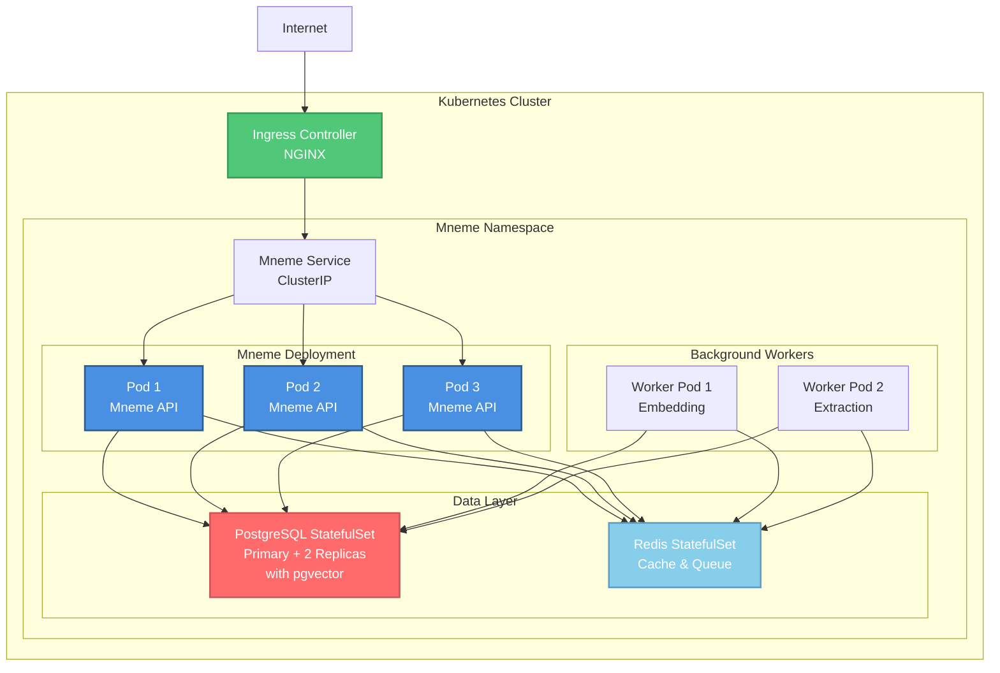

---

## Data Model - Storage Schema

**Purpose**: Show database structure

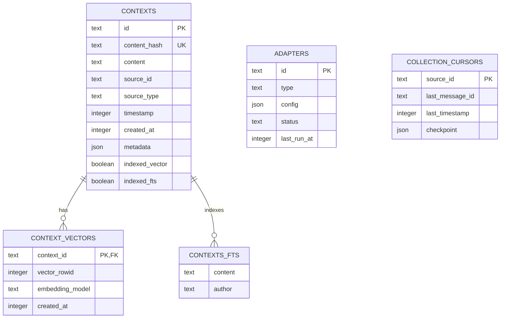

---

## State Diagram - Adapter Lifecycle

**Purpose**: Show adapter state transitions

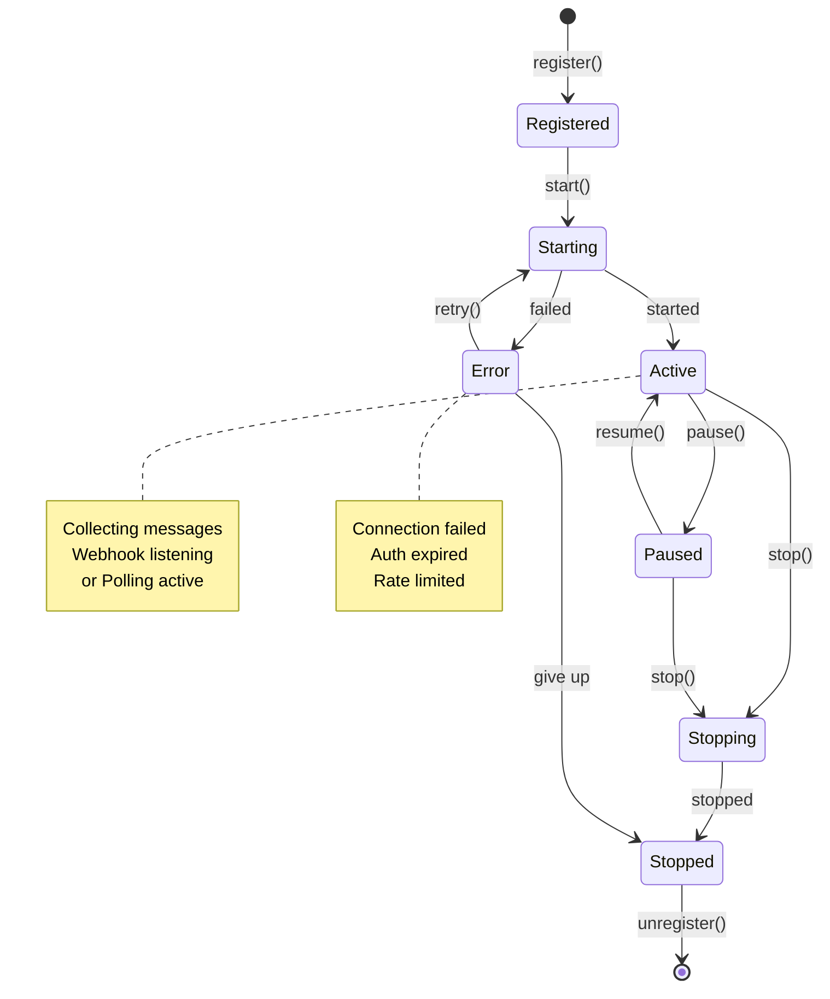

---

## Summary

These Mermaid diagrams provide a comprehensive architectural view of Mneme at multiple levels:

1. **Context**: System boundaries and external interactions
2. **Containers**: Major services and their technologies
3. **Components**: Internal structure of key services
4. **Code**: Class hierarchies for extensibility
5. **Sequences**: Runtime behavior and data flow
6. **Deployment**: Infrastructure and scaling
7. **Data**: Storage schema and relationships
8. **State**: Component lifecycle management

**Rendering**:
- GitHub automatically renders Mermaid in Markdown
- VS Code: Install "Markdown Preview Mermaid Support" extension
- Docs sites: Most support Mermaid natively (GitBook, Docusaurus, etc.)

**Editing**:
- Live editor: https://mermaid.live/
- VS Code: "Mermaid Preview" extension
